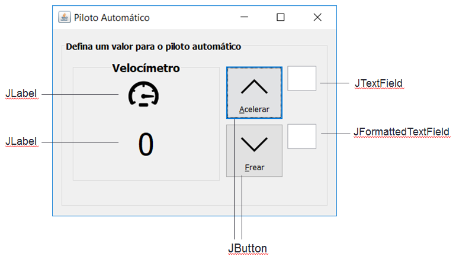

# Aula5 - Introdução a Controles Swing
Objetivo: Apresentar o funcionamento dos controles básicos do pacote gráfico do java swing

* Utilize o protótipo a seguir como referência  

### Tarefa 1 - Botões, Caixas de Texto e Imagens
1.1 Adicione um _JLabel_, uma caixa de texto _JTextField_ e um _JFormattedTextField_ ao formulário ***"AceleradorView"*** para informar a velocidade a ser incrementada (com 2 dígitos), observando as seguintes regras:

1.2 Adicione um _JLabel_ para exibir a velocidade atual chamado de lblVelocidadeAtual

1.3 Adicione 2 botões “btnAcelerar” e “btnFrear” com ícones (seta-cima.png e seta-baixo.png) e um _JLabel_ com a imagem “velocidade.png”.

1.4 Ao clicar no btnAcelerar, se a caixa de texto ao lado do botão estiver vazia, incremente de 10 em 10 a velocidade atual do objeto ***meucarro*** usando o método ***acelerar()*** sem parâmetros.
* Para validar se o JTextField ou JFormattedTextField estão vazios, utilize: <code> if(nomeObjTextField.getText().trim().equals("")) </code>
* Se a caixa de texto for preenchida, incremente a velocidade do objeto ***meucarro*** com o valor informado na caixa de texto, usando o método ***acelerar(int velocidade)***

1.5 Exiba a velocidade no _JLabel_ “lblVelocidadeAtual”

1.6 Repita o passo 1.4 para o botão frear, só que ao invés de usar o método ***acelerar()***, utilize o método ***frear()***
